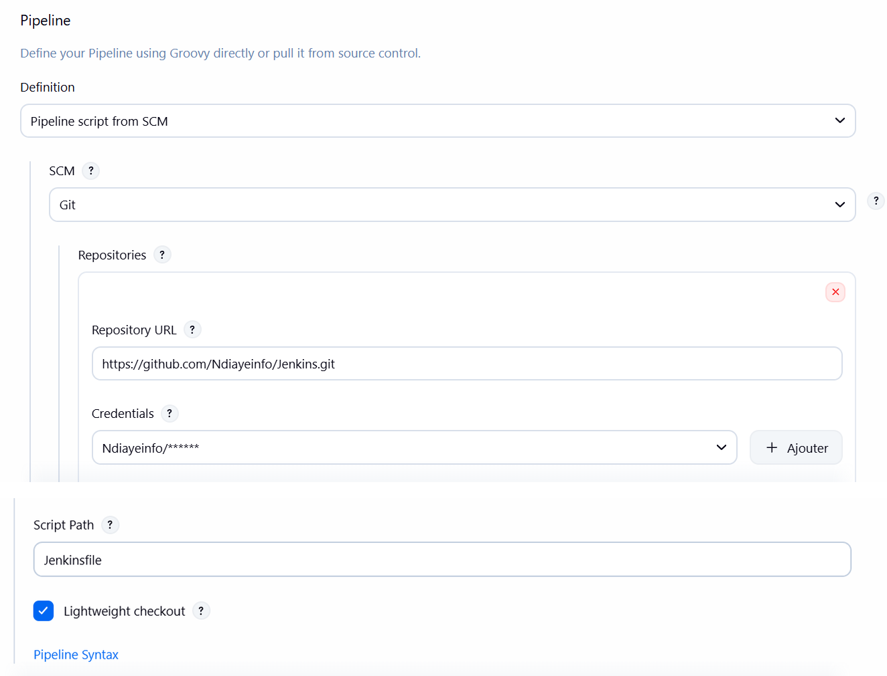
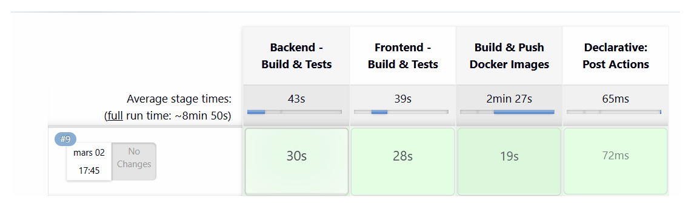

# Projet Jenkins - CI/CD (FastAPI + React)

Ce dépôt contient une application **full‑stack** (backend **FastAPI** + frontend **React**) et un pipeline **Jenkins** (Docker) pour automatiser :

- Build & tests backend
- Build & tests frontend
- Build & push des images Docker vers Docker Hub

## Architecture


## Structure du dépôt

- **`backend-fastapi-gtp/`** : API FastAPI + `docker-compose.yaml` (PostgreSQL + PGAdmin + backend)
- **`frontend-react-gtp/`** : application React + Dockerfile + docker-compose
- **`Jenkinsfile`** : pipeline Jenkins déclaratif
- **`docs/`** : documents et schémas (images)

## Démarrage rapide (Docker)

### Backend (API + DB)

Depuis la racine du repo :

```powershell
docker build -t backend-fastapi-gtp .\backend-fastapi-gtp

$env:BACKEND_IMAGE="backend-fastapi-gtp"
$env:BACKEND_IMAGE_TAG="latest"
docker compose -f .\backend-fastapi-gtp\docker-compose.yaml up -d
```

- Backend : `http://localhost:8000/docs`
- PGAdmin : `http://localhost:8080`

### Frontend (React)

```powershell
docker compose -f .\frontend-react-gtp\docker-compose.yml up -d
```

- Frontend : `http://localhost:3000`

## Jenkins (local via Docker)

Exemple de commande pour lancer Jenkins en local avec accès Docker :

```powershell
docker run -d --name jenkins-lts `
  -p 8081:8080 -p 50000:50000 `
  -v jenkins_home:/var/jenkins_home `
  -v /var/run/docker.sock:/var/run/docker.sock `
  jenkins/jenkins:lts-jdk17
```

Dans Jenkins, créer un job Pipeline “Pipeline script from SCM” pointant vers ce dépôt et utiliser :

- **Script Path** : `Jenkinsfile`
- **Credentials Docker Hub** : ID `dockerhub-credentials`

## Captures d’écran à ajouter (pour le compte rendu)

- **[Capture]** Jenkins – configuration du job (SCM + Jenkinsfile)


- **[Capture]** Jenkins – build réussi (stages en vert)


- **[Capture]** Docker Hub – images publiées (backend + frontend)
- **[Capture]** Swagger (`/docs`) du backend
- **[Capture]** UI du frontend (liste des employés)

